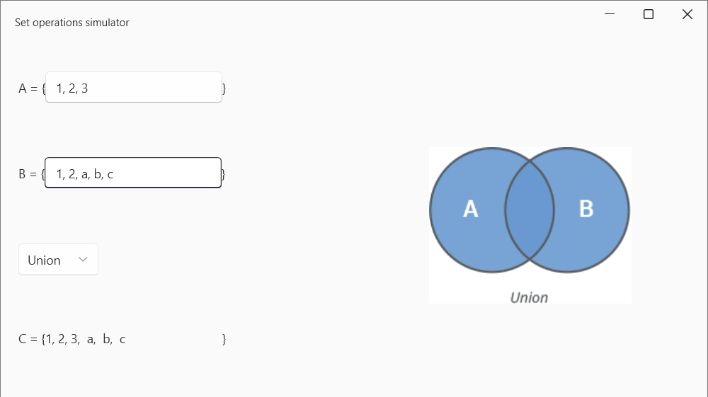

# Discrete Math set operations simulator

This is the example app of set operations like Union, Difference, SymmetricDifference, Intersection.

App maded using WPF and WPFUI framework (for cool UI :))

When you write somethings into TextBoxes, set C automatically updates.

### Features

- Automatically updates when typed something.
- Allow to type numbers, integer and float, also strings.